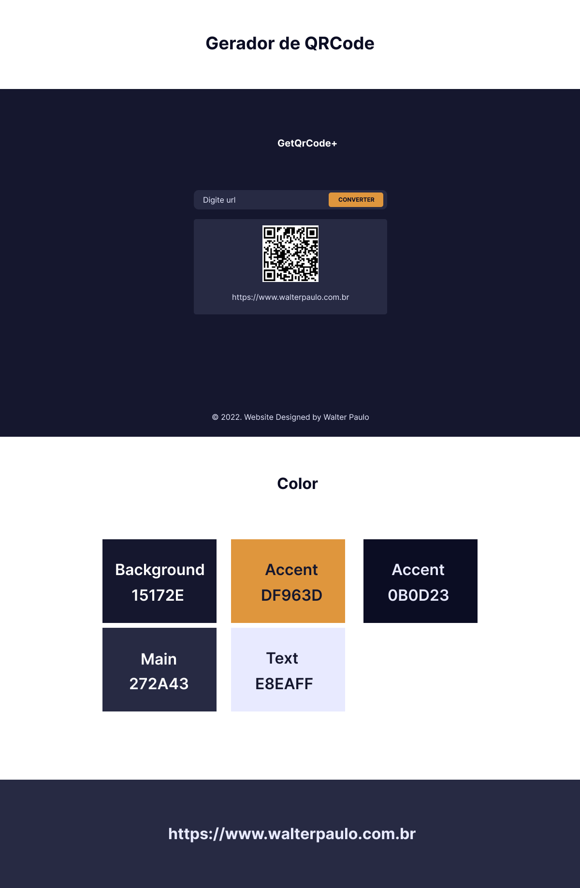

## Gerador de QrCode

* Gerador de QrCode;
* Print de QrCode(Download);
* Somente URL válida;;
* Design responsivo;
* Projeto Web;

### Tecnologias

* React JS v18.0.0;
* Vite JS v2.9.0;
* Styled Components v5.3.5
* TypeScript

[Quero ver o vídeo agora](https://www.youtube.com/watch?v=Ja1MfhQfSoo)